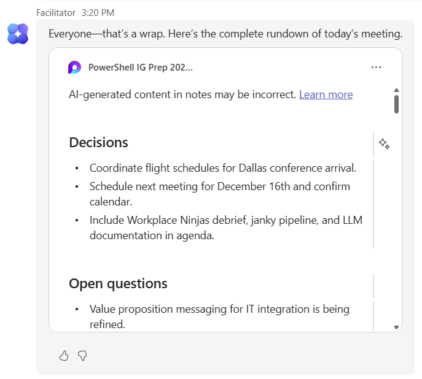

# M365 Copilot Facilitator

A demonstration of Microsoft 365 Copilot's Facilitator feature, which helps create more effective meetings with AI-powered assistance for note-taking, action items, and meeting facilitation.

## About This Demo

This demo showcases the **Microsoft 365 Copilot Facilitator** feature, which provides:
- Pre-enabled meeting setup for AI assistance
- Real-time meeting facilitation and note-taking
- Automatic generation of meeting notes and action items
- Enhanced meeting productivity and follow-up

## Demo Resources

### 1. Creating a Meeting with Facilitator Pre-enabled

Learn how to set up a meeting with Facilitator enabled from the start.

**[Watch on YouTube](https://youtu.be/sy2SSWGTCRU)**

---

### 2. Facilitator Meeting Experience

See Facilitator in action during a live meeting.

**[Watch on YouTube](https://youtu.be/Ya_4bUICPVw)**

---

### 3. That's a Wrap!

*Note: This is a placeholder image. The actual image will be uploaded separately.*

---

### 4. Facilitator Meeting Notes and Action Items Experience

Explore how Facilitator automatically generates meeting notes and tracks action items.

**[Watch on YouTube](https://youtu.be/7DwmR2Rv6BQ)**

---

## Key Features

- **AI-Powered Note-Taking** - Automatic capture of meeting discussions and key points
- **Action Item Tracking** - Identifies and assigns action items during meetings
- **Meeting Summaries** - Generates comprehensive meeting summaries
- **Enhanced Collaboration** - Improves meeting productivity and follow-up

## Target Audience

Organizations and teams using Microsoft 365 who want to:
- Improve meeting efficiency
- Ensure better follow-up on action items
- Reduce time spent on manual note-taking
- Enhance meeting documentation and accountability
